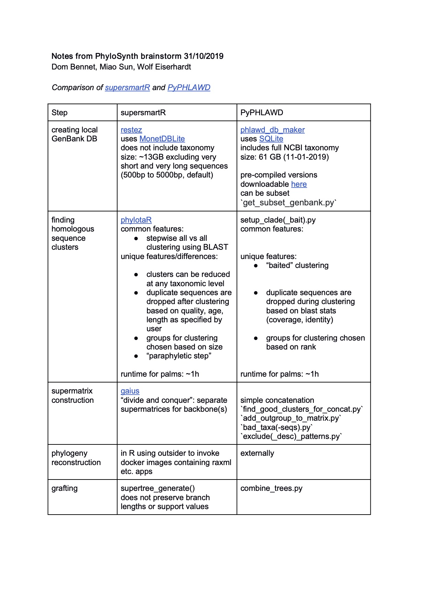
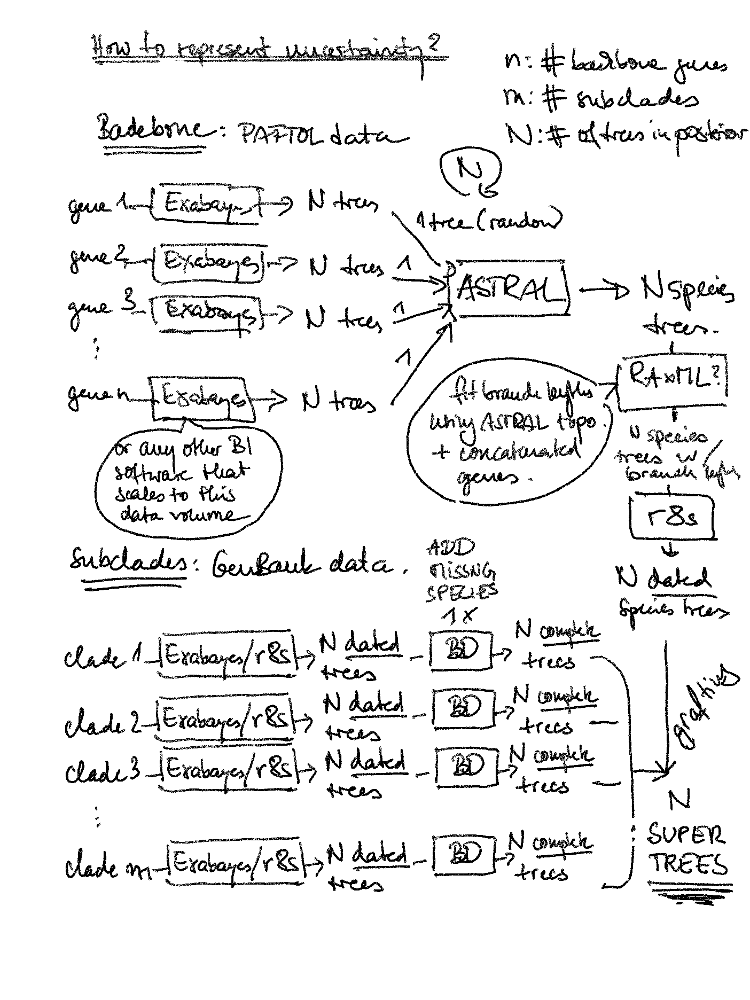
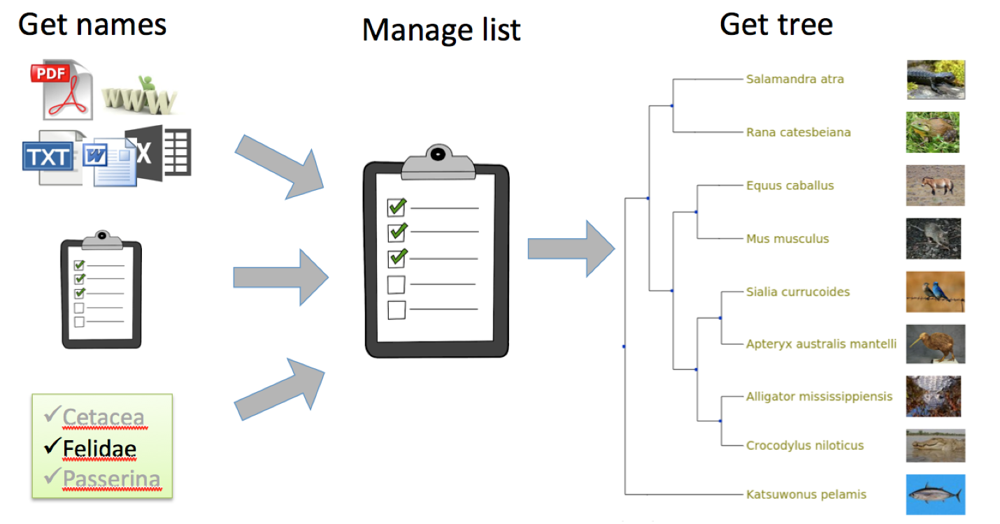

# Phylosandbox

# [Phylosynth](https://github.com/phylosynth)

We are marching on Phylosynth project! Some primary data, code and results will share here. Our goal is reconstructing [**a larger-scale plant Tree of Life**](https://bsapubs.onlinelibrary.wiley.com/doi/10.1002/ajb2.1041) for all [seed plants (Spermatophyta)](https://www.ncbi.nlm.nih.gov/Taxonomy/Browser/wwwtax.cgi?id=58024), using methods described in [Smith and Brown (2018)](https://bsapubs.onlinelibrary.wiley.com/doi/full/10.1002/ajb2.1019) and ideas described in [Eiserhardt et al. (2018; see below)](https://bsapubs.onlinelibrary.wiley.com/doi/pdf/10.1002/ajb2.1041), and integrating the phylogenetic backbone from  [the Plant and Fungal Trees of Life Project (PAFTOL)](https://www.kew.org/science/our-science/projects/plant-and-fungal-trees-of-life) and robust taxonomy database from [World Checklist of Selected Plant Families (WCSP)](https://wcsp.science.kew.org/home.do). We endeavor to push the boundary of the knowledge of Tree of Life, keeping this tree portable and dynamically updated, providing knowledge of the plant tree of life to science community and the public education.  

](./image/work_flow.png)  

### [Some key feactures](https://docs.google.com/document/d/1Hb-G9_WXhCpTpv7mpXrcS_UOH7giolAgjk9nBsRaL50):

####  Flexible  

      Easy for other pipelines to integrate  

####  Dynamically updated  

       Establish a schedule for running this pipeline at regular intervals, producing up-to-date trees. For this, we need to decide an initial frequency for generating trees. This frequency can later be adjusted based on download statistics and user feedback.  

####  Portable for different audiences  

       Establish one or more outlet(s) for PhyloSynth trees. This needs to take into consideration where different audiences would be looking for trees, and ensure (for scientific audiences) that there is a citable paper.   
      
####  High quality  

       Build module that maps NCBI taxonomy to a widely accepted botanical taxonomy. This should in the first place be the WCSP/”names backbone” at Kew, but we need to consider the fact that other lists are in circulation.  
      
      Build a module that filters NCBI data automatically according to certain rules. This could be a simple decision tree based on metadata, or a more complex machine learning approach. 
      
      Build a module that evaluates resulting trees automatically using a set of statistics. This could include, among other things, monophyly statistics for higher ranks from the taxonomy used (genera and families in the case of WCSP).  

      Establish a procedure for manual quality control by taxon experts. This would need to include a procedure for storing decisions/annotations and avoiding duplication of effort.  
      
      Establish a procedure for user feedback. This would need to include a procedure for storing decisions/annotations and avoiding duplication of effort. 

The general workingflow is outlined below.  

All the scripts can be found [here](https://github.com/phylosynth/Phylosandbox/tree/master/script).  

## Task CheckList
- [x] **Taxonomic databases**
	* **[WCSP](https://wcsp.science.kew.org/home.do)**  
	 **#meta data "meta.xml"**  
    `# Column0=taxonID`  
    `# Column1=modified`  
    `# Column2=verbatimTaxonRank`  
    `# Column3=scientificName`  
    `# Column4=family`  
    `# Column5=genus`  
    `# Column6=specificEpithet`  
    `# Column7=infraspecificEpithet`  
    `# Column8=scientificNameAuthorship`  
    `# Column9=nomenclaturalStatus`  
    `# Column10=rightsHolder`  
    `# Column11=namePublishedInYear`  
    `# Column12=nomenclaturalCode`  
    `# Column13=taxonRemarks`  
    `# Column14=bibliographicCitation`  
    `# Column15=language`  
    `# Column16=class`  
    `# Column17=references`  
    `# Column18=license`  
    `# Column19=rights`  
    `# Column20=namePublishedIn`  
    `# Column21=taxonRank`  
    `# Column22Plantae=kingdom`  
    `# Column23=phylum`  
    `# Column24=parentNameUsageID`  
    `# Column25=acceptedNameUsageID#`  
    `# Column26=originalNameUsageID`  
    `# Column27=taxonomicStatus#`  
    `# Column28=source`  
        - We only keep these columns from **WCSP** for downstream mapping:  
    `taxonID, verbatimTaxonRank, scientificName, genus, specificEpithet, infraspecificEpithet, scientificNameAuthorship, family, acceptedNameUsageID, taxonomicStatus`  
      `WCSP_database.R`  
	
	* **NCBI taxonomy**  
	    + Made new NCBI databased using `phlawd_db_maker`:  
	      `phlawd_db_maker pln /data_vol/miao/plnDB20191101/plnDB20191101.db`  
	    + Modified the [PyPHLAWD](https://github.com/FePhyFoFum/PyPHLAWD) `get_ncbi_tsv.py` script as `get_ncbi_tsv_miao.py`, by adding in more detailed filters in `SQL` syntax to get a semi-clean **Spermatophyta58024** taxonomy and with authority information:  
		
	      `c.execute("select ncbi_id,parent_ncbi_id,name,node_rank from taxonomy WHERE (name_class = 'scientific name' OR name_class = 'authority') \
    AND (node_rank = 'no rank' OR node_rank = 'order' OR node_rank = 'family' OR node_rank = 'genus' OR node_rank = 'species' OR node_rank = 'subspecies' \
    OR node_rank = 'varietas' OR node_rank = 'forma')")`  
    
      + Clean and reformat the NCBI taxonomy  
      
        `Spermatophyta_plnDB_cleanerV1.1.sh`  
          _Details see the comments inside the script._  
          e.g., _Remove species with `cf.` and `aff.` tags_  
          _Remove `Genus_sp._Collection#`_  
			  	_Keep it if the frequency of the genus equals to 1, for place holder_  
          
        
        `remove_duplicate.py`  
          _Remove duplicate lines_
        
        `Spermatophyta_sp_authority_format.py`  
          _This script will make a serials of decisions on each line of taxonomic information, and then reformat it based on `Authority, species, subspecies, varietas, forma` etc._  
		 **Challenge:**  
           `454232,Cucumis_x_Cucurbita,genus`  
           `2005747,Parasponia_x_Trema,genus`  
		
          Attached decision tree diagram later.  
          
	
	* **Mapping tactics**  
	  + `NCBI_WCSP_Taxonomy_Merge.R`  
	      - Mapping based on species names  
	      - If the same name different ids, then decision depends on `Authority`  
	      - Syn names pointting the Accepted names
	  
	  + Other python script?  
	
- [] **Data mining**  

1. [] **_Molecular data_**  
	* GenBank data mining using [PyPHLAWD](https://github.com/FePhyFoFum/PyPHLAWD)
	* Choose gene with most coverage _(the good clusters)_  
	* Sequence length  
	
	* Alternative --- [supersmartR](https://github.com/AntonelliLab/supersmartR)  
	      o. Comparison of supersmartR and PyPHLAWD by Dom Bennet, Miao Sun, and Wolf Eiserhardt  

      

	
2. [x] **_Fossil data_**
	* [Magallón et al. (2015)](https://nph.onlinelibrary.wiley.com/doi/10.1111/nph.13264)
	* [TimeTree](http://www.timetree.org/)
	* Other secondary calibration points  
	
3. [] **_Environmental/Traits data_**
	* [WorldClim](http://www.worldclim.org/)?
	* Tropicality?  

- [] **Data cleaning and evaluation**  
    * Sequence data cleaning
    * Taxonomic names cleaning
    * Topology constraint
    * Monophyletic constraint  
  
- [] **Phylogeny and dating**
	 * Adding constraint tree from [the Plant and Fungal Trees of Life Project (PAFTOL)](https://www.kew.org/science/our-science/projects/plant-and-fungal-trees-of-life) []  
	 * Updated the phylogeny with Pyphlawd data and constraint tree  
	    + [RAxML-NG](https://github.com/amkozlov/raxml-ng) _#more efficient when conducting constrained analyses_
	    + [IQTree](http://www.iqtree.org/) _#has several branch length options when concatenating_    
	 * Building subset trees at family level/or order level (_depends on group size_)
	 * All names need to be validated by **WCSP**  
	 
	 * Dating use [treePL](https://github.com/blackrim/treePL)
	 * Calibration points mentioned above (**_Fossil data_**) and [here](https://github.com/phylosynth/Phylosandbox/tree/master/data/Calibration_points)  
	 * Multiple secondary calibration points provided by [Congruification](https://besjournals.onlinelibrary.wiley.com/doi/full/10.1111/2041-210X.12051)

- [] **Tree Grafting/Subsetting**  
	- [OpenTree PY Toys](https://github.com/blackrim/opentree_pytoys)  
	
- [] **Psedu-posterior**  
	- [TACT (Taxonomic Addition for Complete Trees)](https://academic.oup.com/sysbio/advance-article/doi/10.1093/sysbio/syz081/5658637):  
		_A new stochastic polytomy resolution method that uses birth-death-sampling estimators across an ultrametric phylogeny to estimate branching times for unsampled taxa, with taxonomic information to compatibly place new taxa onto a backbone phylogeny._  
		
		[TACT](https://github.com/jonchang/tact/) is also used in [Rabosky et al. (2018)](https://www.nature.com/articles/s41586-018-0273-1)  
- [] **How to integrate uncertainty**  
      
+ Other uncertainty test:  
    - Quartet Sampling from [Pease et al. (2018)](https://bsapubs.onlinelibrary.wiley.com/doi/full/10.1002/ajb2.1016)

## Other stuff

+ Required more thinking  
  * Species tree approach (ASTRAL) - reconstruct cluster trees first, then species tree  
    + Can this species tree has a branch length? How? What's meaning/represnting?  
    + Support value? and uncertainty?  
    
  * Back-filling unsequenced species  
  * Disseminating trees:  
    + GIT-based repository for trees ([PhyloSynth repo](https://github.com/phylosynth))   
    + Hosted on [Zenodo](https://zenodo.org/) with doi for each tree  
    + Push trees to Github, perform continuous integration tests (Travis) on trees and metadata, trying to catch potential issues (incongruence with taxonomy, changes compared to last version, abnormally long branches etc.)  
    + Tree viewer? (e.g., [Dendroscope3](http://dendroscope.org/))  
    
  * Service portal
    + Name checking service  
    + Coommon namce and nickname (_public not necessary know/use the scientific names_)  
      example: [Phylotastic](https://phylo.cs.nmsu.edu/)  

        

    

+ Subtle:  

* Lists and tables better use ".csv" format put into "data" folder
* References and other Documents put into "reference" folder
* Likewise scripts go to "script" foder  
* Draw a diagram for workingflow
* More detailed description for methods used  

Last update:  
_Fri Jan  14 14:33:34 2020_  

